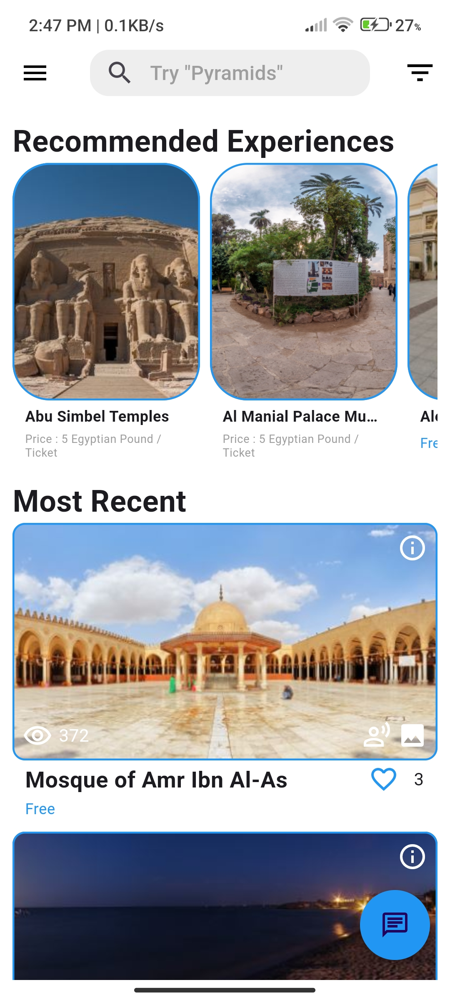
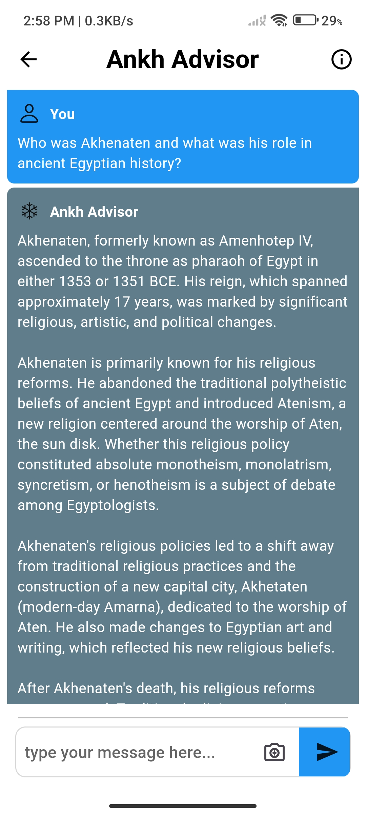
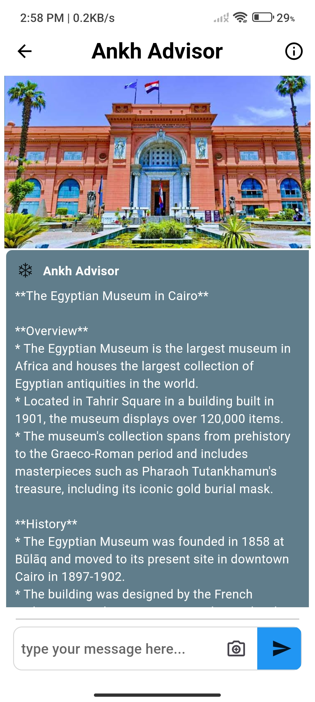
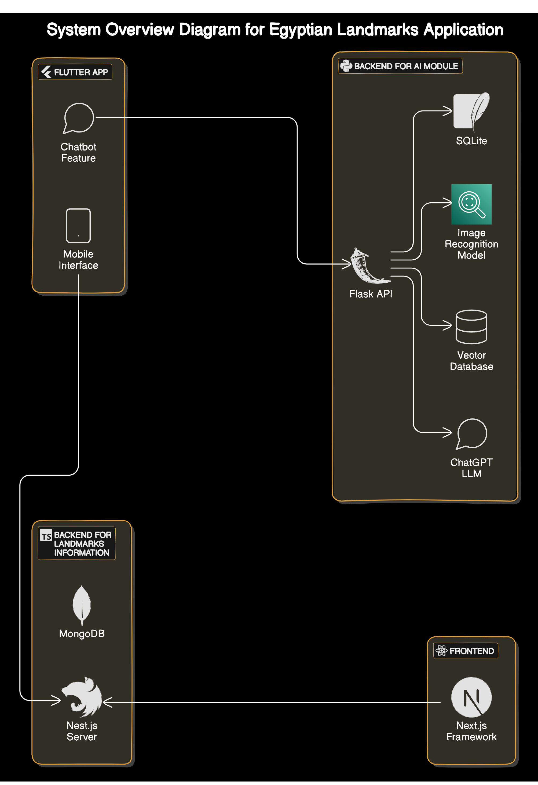
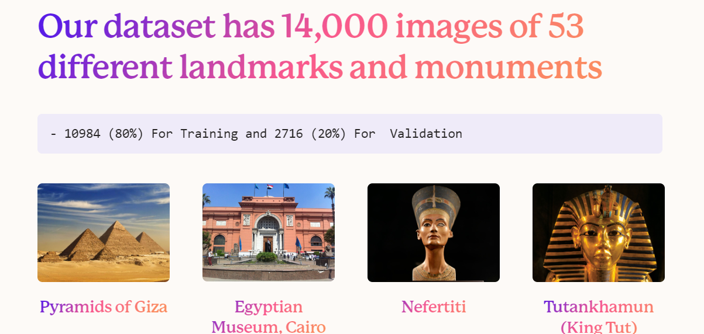

# Egyptian Landmarks App

## Table of Contents

1. [Project Idea](#project-idea)
2. [Problem Statement](#problem-statement)
3. [Project Overview](#project-overview)
4. [Tools and Technologies](#tools-and-technologies)
5. [Dataset & Pre-processing](#dataset-pre-processing)
6. [Objective](#objective)
7. [Key Features](#key-features)
8. [User Experience](#user-experience)
9. [Future Work](#future-work)
10. [Conclusion](#conclusion)

## Project Idea

### App Concept

<table>
<tr>
<td>

  Our project aims to create a mobile app that showcases Egypt's famous landmarks. Using Flutter, the app will give users detailed information, historical facts, and interactive features to help them learn more about Egypt's rich cultural history. With an AI chatbot, users will have a personal guide at their fingertips, making their exploration fun and informative.

</td>
<td>

  

</td>
</tr>
</table>

### Landmark Information and Evaluation

<table>
<tr>
<td>

  With this app feature, users can quickly find tourist spots, read or listen to lots of details about them, and leave their own reviews or see what others think. It helps users plan trips better, learn more about the places they visit, and share their experiences to help others plan their trips too.

</td>
<td>

  

</td>
</tr>
</table>

## Problem Statement

<table>
<tr>
<td>

  Even though Egypt has many famous landmarks, there aren't many easy and engaging ways for tourists and locals to learn about them. Traditional guides and websites often provide boring, static information. Our app solves this problem by offering a dynamic, AI-driven platform to make learning about these sites more interactive and personalized.

</td>
<td>

  

</td>
</tr>
</table>

## Project Overview

<table>
<tr>
<td>

  The Egyptian Landmarks App is designed to be a one-stop shop for exploring Egypt's historical sites. Key features include:
  <ul>
    <li>A big list of landmarks with details and pictures.</li>
    <li>An AI chatbot for personalized information and recommendations.</li>
    <li>The ability to upload photos and have the app recognize landmarks.</li>
    <li>Search and filter options for easy navigation.</li>
    <li>Suggestions based on user preferences.</li>
  </ul>

</td>
<td>

  

</td>
</tr>
</table>

## Tools and Technologies

  The app uses various modern technologies to provide a smooth and engaging experience:

### Frontend

- **Flutter** for a cross-platform, visually attractive, and responsive UI.
- **Next.js** for the admin dashboard.

### Backend

- **Nest.js** to keep everything organized and handle large amounts of data.
- **Flask** to manage models and chat functionalities.

### AI and ML

- **TensorFlow** for image recognition.
- **OpenAI** for natural language processing.
- **Faiss** for storing embeddings for quick retrieval.

### Database

- **MongoDB**, **Redis**, and **SQLite** for storing landmark data and user interactions.

## Dataset & Pre-processing

<table>
<tr>
<td>

  Our dataset contains 14,000 images of 53 different landmarks and monuments.
  <ul>
    <li>Training: 10,984 images (80%)</li>
    <li>Validation: 2,716 images (20%)</li>
  </ul>

  <h4>Pre-processing Steps</h4>
  <ul>
    <li>Resizing images to 150x150 pixels.</li>
    <li>Data augmentation techniques:</li>
    <ul>
      <li>Rotation</li>
      <li>Shear</li>
      <li>Width Shift</li>
      <li>Zoom</li>
      <li>Height Shift</li>
      <li>Brightness</li>
      <li>Horizontal Flip</li>
      <li>Vertical Flip</li>
    </ul>
  </ul>

</td>
<td>

  

</td>
</tr>
</table>

## Objective

  The main goals of our project are:
  <ul>
    <li>To create an engaging and educational platform for exploring Egyptian landmarks.</li>
    <li>To use AI and machine learning to provide a personalized and fun experience.</li>
    <li>To make learning about culture fun and easy for everyone.</li>
  </ul>

## Key Features

### Landmark List

<table>
<tr>
<td>

  Users can browse, search, and learn about a large collection of Egyptian landmarks with detailed information and beautiful pictures.

</td>
</tr>
</table>

### AI-Powered Interactions

  The app’s chatbot and image recognition features let users interact with the app in a fun way, making learning more interesting.

### Search and Filter

  Users can easily search for specific landmarks or filter the list by category, region, or other criteria to find the information they need.

## User Experience

### Search

  Easily find specific landmarks or browse by category, region, or other criteria.

### Image Recognition

  Upload photos and let the app's AI identify the landmark and provide detailed information.

### Chatbot

  Engage with the app's natural language processing chatbot to ask questions and learn more.

## Future Work

  To keep improving the app, we plan to:
  <ul>
    <li>Add more landmarks and detailed information.</li>
    <li>Make the AI chatbot even smarter for more accurate and personalized responses.</li>
    <li>Add new features like virtual tours and augmented reality experiences.</li>
    <li>Translate the app into multiple languages to reach more people.</li>
  </ul>

## Conclusion

<table>
<tr>
<td>

  The Egyptian Landmarks App is a new way to explore Egypt's rich cultural history. By using advanced technologies like AI and machine learning, we offer users a fun, informative, and personalized experience. As we continue to develop the app, we aim to make learning about culture enjoyable for everyone.

</td>
</tr>
</table>
